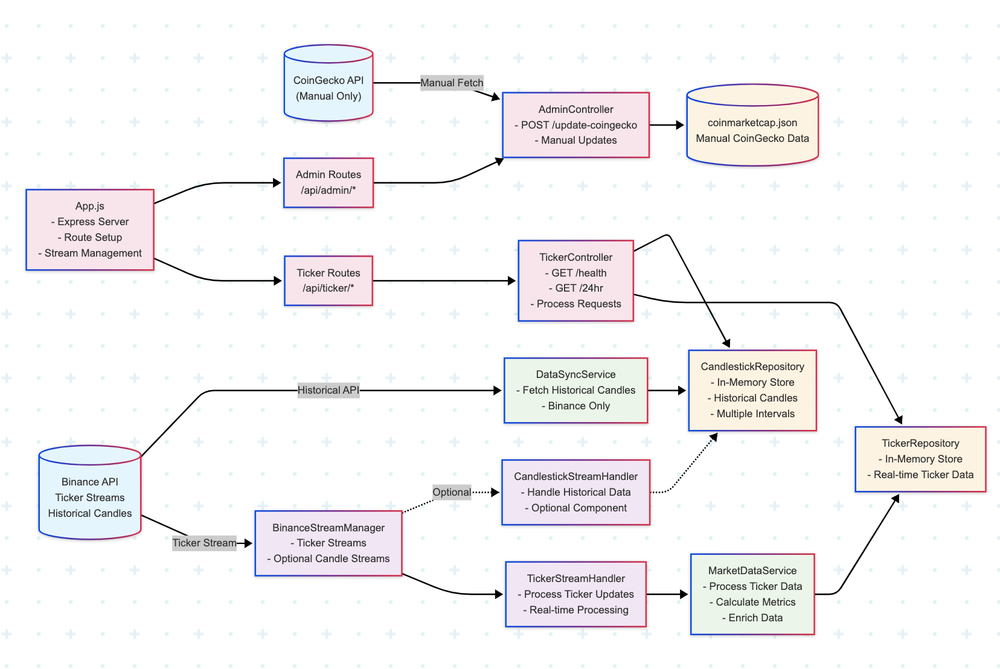

# Spikey Coins Proxy Server

A comprehensive Node.js proxy server for cryptocurrency data that provides real-time ticker information, candlestick charts, and market cap data while bypassing CORS issues for frontend applications.

## 🚀 Features

- **Real-time Data**: WebSocket streams from Binance for live ticker and candlestick data
- **Market Data**: Integration with CoinGecko API for market capitalization information
- **Rate Limiting**: Built-in protection against API rate limits
- **CORS Support**: Configured to work seamlessly with frontend applications
- **Comprehensive Documentation**: OpenAPI 3.0 specification with Swagger UI

## 📊 Data Sources

- **Binance WebSocket API**: Real-time ticker data and 15-minute candlestick streams
- **CoinGecko REST API**: Market capitalization and additional coin metadata

## 🛠️ Installation

1. Clone the repository:

   ```bash
   git clone <repository-url>
   cd node-server
   ```

2. Install dependencies:

   ```bash
   npm install
   ```

3. Set up environment variables:

   ```bash
   # Create a .env file in the root directory
   COINGECKO_API_KEY=your_coingecko_api_key_here
   PORT=8000
   ```

4. Start the server:

   ```bash
   # Development mode (with nodemon)
   npm run dev

   # Production mode
   npm start
   ```

## 📚 API Documentation

Once the server is running, you can access the interactive API documentation at:

- **Swagger UI**: http://localhost:8000/docs
- **OpenAPI Spec (JSON)**: http://localhost:8000/openapi.json

## 🔗 API Endpoints

### Health Check

- `GET /` - Server health check and basic information
- `GET /api/ticker` - Ticker router health check with statistics

### Ticker Data

- `GET /api/ticker/24hr` - Get 24-hour ticker data for all symbols with short-term changes (1h, 4h, 8h, 12h)

### Candlestick Data

- `GET /api/ticker/candlestick` - Get summary of available candlestick data
- `GET /api/ticker/candlestick/{symbol}` - Get detailed candlestick data for a specific symbol

### Market Data

- `GET /api/ticker/marketCap` - Get market capitalization data from CoinGecko
- `GET /api/ticker/refreshMarketcapData` - Refresh market cap data (placeholder)

## 📈 Data Features

### Ticker Data

- Real-time 24-hour statistics
- Short-term price changes (1h, 4h, 8h, 12h) calculated from candlestick data
- Volume and price change information
- Market cap integration where available

### Candlestick Data

- 15-minute interval candlesticks
- Up to 48 candlesticks per symbol (12 hours of data)
- OHLCV (Open, High, Low, Close, Volume) data
- Used for calculating short-term price movements

### Rate Limiting

- Maximum 50 requests per minute to external APIs
- Automatic backoff and retry mechanisms
- Real-time monitoring and protection

## 🏗️ Architecture

The server uses:

- **Express.js** for the REST API framework
- **WebSocket connections** to Binance for real-time data
- **Axios** for HTTP requests to external APIs
- **CORS middleware** for cross-origin support
- **Rate limiting** to prevent API abuse



## 🔧 Configuration

### Environment Variables

- `COINGECKO_API_KEY`: Required for market cap data from CoinGecko
- `PORT`: Server port (default: 8000)

### Major Tracked Symbols

The server initially tracks these major cryptocurrency pairs:

- BTCUSDT, ETHUSDT, BNBUSDT, ADAUSDT
- SOLUSDT, XRPUSDT, DOTUSDT, DOGEUSDT

## 🚦 Usage Examples

### Get All Ticker Data

```bash
curl http://localhost:8000/api/ticker/24hr
```

### Get Candlestick Data for Bitcoin

```bash
curl http://localhost:8000/api/ticker/candlestick/BTCUSDT
```

### Get Market Cap Data

```bash
curl http://localhost:8000/api/ticker/marketCap
```

## 🔍 Monitoring

The server provides real-time statistics including:

- Number of tracked ticker symbols
- Candlestick data availability
- Rate limiting status
- Request counts and windows

## 🛡️ Error Handling

All endpoints return standardized error responses with:

- `success: false` indicator
- Descriptive error messages
- Appropriate HTTP status codes

## 📝 Development

### Scripts

- `npm start` - Start the production server
- `npm run dev` - Start with nodemon for development
- `npm test` - Run tests (placeholder)

### Project Structure

```
node-server/
├── app.js                 # Main application file
├── package.json           # Dependencies and scripts
├── openapi.yaml          # API documentation specification
├── README.md             # This file
├── routers/
│   └── ticker-router.js  # Ticker API routes
└── coin-data/
    ├── coingecko-ids.json      # CoinGecko coin mappings
    ├── coinmarketcap.json      # Market cap data
    └── coin-gecko-coins-list.json
```

## 🤝 Contributing

1. Fork the repository
2. Create a feature branch
3. Make your changes
4. Test thoroughly
5. Submit a pull request

## 📄 License

ISC License - see package.json for details
