# Spikey Coins Proxy Server

A comprehensive Node.js proxy server for cryptocurrency data that provides real-time ticker information, candlestick charts, and market cap data while bypassing CORS issues for frontend applications.

## 🚀 Features

- **Real-time Data**: WebSocket streams from Binance for live ticker and candlestick data
- **Market Data**: Integration with CoinGecko API for market capitalization information
- **Rate Limiting**: Built-in protection against API rate limits
- **CORS Support**: Configured to work seamlessly with frontend applications
- **Comprehensive Documentation**: OpenAPI 3.0 specification with Swagger UI

## 📊 Data Sources

- **Binance WebSocket API**: Real-time ticker data and 15-minute candlestick streams
- **CoinGecko REST API**: Market capitalization and additional coin metadata

## 🛠️ Installation

1. Clone the repository:

   ```bash
   git clone <repository-url>
   cd node-server
   ```

2. Install dependencies:

   ```bash
   npm install
   ```

3. Set up environment variables:

   ```bash
   # Create a .env file in the root directory
   COINGECKO_API_KEY=your_coingecko_api_key_here
   PORT=8000
   ```

4. Start the server:

   ```bash
   # Development mode with auto-reload (recommended)
   npm run dev

   # Production mode
   npm start
   
   # TypeScript mode (direct execution)
   npm run start:ts
   ```


## 🚀 Quick Start

```bash
cd node-server
npm install
npm run dev
```

This server features a **streamlined architecture** that provides:
- **Efficient design** - 3 core files with direct data flow  
- **Complete API coverage** - All cryptocurrency data endpoints
- **Multiple data intervals** - 1m, 5m, 15m, 30m, 1h candlestick support
- **Real-time data** - WebSocket streams from Binance API
- **Discovery & statistics** - Symbol discovery metrics and storage stats  
- **Market data** - Local CSV file integration for market cap data
- **Production ready** - Error handling, logging, documentation

## 📚 API Documentation

Once the server is running, you can access the interactive API documentation at:

- **Swagger UI**: http://localhost:8000/docs
- **OpenAPI Spec (JSON)**: http://localhost:8000/openapi.json

## 🔗 API Endpoints

### Health & Status

- `GET /` - Server health check and basic information
- `GET /api/ticker` - Ticker service health check with detailed statistics

### Ticker Data

- `GET /api/ticker/24hr` - Get 24-hour ticker data for all symbols (400+ coins)
- `GET /api/ticker/symbol/{symbol}` - Get individual ticker data for a specific symbol

### Candlestick Data

- `GET /api/ticker/candlestick` - Get summary of all available candlestick data
- `GET /api/ticker/candlestick/{symbol}` - Get candlestick data for a symbol
  - **Query Parameters**: `?interval=1m|5m|15m|30m|1h` (default: 15m)
  - **Examples**: 
    - `/api/ticker/candlestick/BTCUSDT?interval=1h` (24 hourly candles)
    - `/api/ticker/candlestick/ETHUSDT?interval=5m` (144 5-minute candles)

### System Statistics

- `GET /api/ticker/storage-stats` - Get storage and memory usage statistics
- `GET /api/ticker/discovery-stats` - Get symbol discovery and ranking statistics

### Market Data

- `GET /api/ticker/marketCap` - Get market capitalization data from local CSV files
- `GET /api/ticker/refreshMarketcapData` - Refresh market cap data (placeholder)

### Documentation

- `GET /docs` - Interactive Swagger UI documentation
- `GET /openapi.json` - OpenAPI specification in JSON format

## 📈 Data Features

### Real-time Ticker Data

- **400+ cryptocurrency symbols** tracked continuously
- **Live WebSocket streams** from Binance API
- **Multiple intervals**: 1m, 5m, 15m, 30m, 1h candlestick data
- **Volume and price metrics**: 24h changes, volume USD, range positioning
- **Symbol discovery**: Automatic detection and ranking by volume

### Advanced Candlestick Data

- **5 different intervals**: 1m (60 candles), 5m (144 candles), 15m (48 candles), 30m (48 candles), 1h (24 candles)
- **OHLCV data**: Open, High, Low, Close, Volume for each interval
- **Historical initialization**: Fetches recent data on startup
- **Real-time updates**: Continuous data stream processing

### System Analytics

- **Storage statistics**: Memory usage, data counts, interval breakdowns
- **Discovery metrics**: Symbol rankings, volume thresholds, active pairs
- **Connection monitoring**: WebSocket status, reconnection handling

### Rate Limiting

- Maximum 50 requests per minute to external APIs
- Automatic backoff and retry mechanisms
- Real-time monitoring and protection

## 🏗️ Architecture

The server uses a streamlined architecture with real-time data processing:

```mermaid
graph TB
    %% External Sources
    subgraph External["🌐 External Data Sources"]
        Binance["📊 Binance WebSocket API<br/>• Real-time ticker data<br/>• Live candlestick streams<br/>• Price updates"]
        CSV["📁 Local CSV Files<br/>• Market cap data<br/>• Historical records<br/>• Scripts output"]
    end

    %% Core Components
    subgraph Core["⚙️ Core Application Layer"]
        Client["🔌 BinanceClient.ts<br/>• WebSocket connection manager<br/>• Auto-reconnection logic<br/>• Stream data parsing<br/>• Historical data fetching"]
        
        Manager["💾 DataManager.ts<br/>• In-memory data storage<br/>• Real-time data caching<br/>• Symbol discovery engine<br/>• Price calculations"]
        
        Routes["🛣️ routes.ts<br/>• HTTP request handlers<br/>• Response formatting<br/>• Input validation<br/>• Error management"]
    end

    %% Server Layer
    subgraph Server["🖥️ Express Server"]
        App["⚡ app.ts<br/>• Express application setup<br/>• CORS & middleware config<br/>• Swagger documentation<br/>• Graceful shutdown handling"]
    end

    %% API Endpoints
    subgraph API["🔗 REST API Endpoints"]
        direction TB
        
        subgraph Health["🏥 Health & Status"]
            H1["GET / → Health Check"]
            H2["GET /api/ticker → Service Status"]
            H3["GET /api/ticker/storage-stats → Memory Stats"]
            H4["GET /api/ticker/discovery-stats → Discovery Info"]
        end
        
        subgraph Trading["📈 Trading Data"]
            T1["GET /api/ticker/24hr → All Tickers"]
            T2["GET /api/ticker/symbol/:SYMBOL → Single Ticker"]
            T3["GET /api/ticker/candlestick → Summary"]
            T4["GET /api/ticker/candlestick/:SYMBOL → OHLCV Data<br/>Intervals: 1m, 5m, 15m, 30m, 1h"]
        end
        
        subgraph Market["💰 Market Data"]
            M1["GET /api/ticker/marketCap → Market Cap Data"]
            M2["GET /api/ticker/refreshMarketcapData → Refresh Data"]
        end
        
        subgraph Docs["📚 Documentation"]
            D1["GET /docs → Interactive Swagger UI"]
        end
    end

    %% Utilities
    subgraph Utils["🛠️ Utilities"]
        Logger["📝 Winston Logger<br/>• Structured logging<br/>• Error tracking<br/>• Debug information"]
    end

    %% Data Flow Connections
    Binance ==> Client
    Client ==> Manager
    CSV ==> Routes
    
    App ==> Routes
    Routes ==> Manager
    
    Routes ==> Health
    Routes ==> Trading
    Routes ==> Market
    Routes ==> Docs
    
    %% Logging Connections
    Logger -.-> App
    Logger -.-> Client
    Logger -.-> Routes

    %% Styling
    classDef external fill:#fff3e0,stroke:#ff9800,stroke-width:3px,color:#e65100
    classDef core fill:#e8f5e8,stroke:#4caf50,stroke-width:3px,color:#2e7d32
    classDef server fill:#f3e5f5,stroke:#9c27b0,stroke-width:3px,color:#6a1b9a
    classDef health fill:#e3f2fd,stroke:#2196f3,stroke-width:2px,color:#0d47a1
    classDef trading fill:#fff8e1,stroke:#ffc107,stroke-width:2px,color:#f57c00
    classDef market fill:#e8f5e8,stroke:#4caf50,stroke-width:2px,color:#388e3c
    classDef docs fill:#fce4ec,stroke:#e91e63,stroke-width:2px,color:#ad1457
    classDef utility fill:#f5f5f5,stroke:#607d8b,stroke-width:2px,color:#37474f

    class Binance,CSV external
    class Client,Manager,Routes core
    class App server
    class H1,H2,H3,H4 health
    class T1,T2,T3,T4 trading
    class M1,M2 market
    class D1 docs
    class Logger utility
```



**🎯 Modern Architecture Design:**

**Current Implementation:**
- **BinanceClient.ts** - WebSocket connection management and data fetching
- **DataManager.ts** - Centralized data storage with advanced calculations
- **routes.ts** - Direct HTTP request handlers

**Key Features:**
- ✅ **Complete API Coverage** - All cryptocurrency data endpoints
- ✅ **Real-time WebSocket Streams** - Live data from Binance API
- ✅ **Multiple Candlestick Intervals** - 1m, 5m, 15m, 30m, 1h support
- ✅ **Individual Ticker Lookup** - `GET /api/ticker/symbol/{symbol}`
- ✅ **Storage & Discovery Statistics** - System metrics and monitoring
- ✅ **Market Cap Integration** - Local CSV file data (reliable)
- ✅ **Production Grade** - Error handling, logging, documentation
- ✅ **Developer Experience** - Swagger docs, CORS support


## 🔧 Configuration

### Environment Variables

- `COINGECKO_API_KEY`: Required for market cap data from CoinGecko
- `PORT`: Server port (default: 8000)

### Major Tracked Symbols

The server tracks **400+ active USDT pairs** automatically discovered from live data, with detailed candlestick data for major pairs:

- **Primary pairs**: BTCUSDT, ETHUSDT, BNBUSDT, ADAUSDT, SOLUSDT, XRPUSDT, DOGEUSDT, AVAXUSDT
- **Auto-discovery**: All pairs with >$1000 24h volume are automatically tracked
- **Rankings**: Symbols ranked by trading volume and updated continuously

## 🚦 Usage Examples

### Get All Ticker Data (400+ symbols)

```bash
curl http://localhost:8000/api/ticker/24hr
```

### Get Individual Ticker

```bash
# Get specific symbol data
curl http://localhost:8000/api/ticker/symbol/BTCUSDT
```

### Get Candlestick Data with Different Intervals

```bash
# Default 15m interval
curl http://localhost:8000/api/ticker/candlestick/BTCUSDT

# 1 hour intervals (24 candles)
curl "http://localhost:8000/api/ticker/candlestick/BTCUSDT?interval=1h"

# 5 minute intervals (144 candles)
curl "http://localhost:8000/api/ticker/candlestick/ETHUSDT?interval=5m"
```

### System Statistics

```bash
# Storage and memory usage
curl http://localhost:8000/api/ticker/storage-stats

# Symbol discovery metrics
curl http://localhost:8000/api/ticker/discovery-stats
```

### Market Cap Data

```bash
curl http://localhost:8000/api/ticker/marketCap
```

## 🔍 Monitoring

The server provides comprehensive real-time monitoring:

### Available Statistics
- **Ticker symbols**: 400+ actively tracked pairs
- **Candlestick symbols**: 8 major pairs with full interval support
- **WebSocket connections**: Status of all data streams
- **Symbol discovery**: Rankings, volume thresholds, and active pairs
- **Storage usage**: Memory consumption and data counts

### Health Endpoints
```bash
# Overall server health
curl http://localhost:8000/

# Detailed ticker service status  
curl http://localhost:8000/api/ticker
```

## 🛡️ Error Handling

All endpoints return standardized error responses with:

- `success: false` indicator
- Descriptive error messages
- Appropriate HTTP status codes

## 📝 Development

### Scripts

- `npm start` - Start the production server
- `npm run dev` - Start with nodemon for development
- `npm test` - Run tests (placeholder)

### Project Structure

```
node-server/
├── app.js                 # Main application file
├── package.json           # Dependencies and scripts
├── openapi.yaml          # API documentation specification
├── README.md             # This file
├── routers/
│   └── ticker-router.js  # Ticker API routes
└── coin-data/
    ├── coingecko-ids.json      # CoinGecko coin mappings
    ├── coinmarketcap.json      # Market cap data
    └── coin-gecko-coins-list.json
```

## 🤝 Contributing

1. Fork the repository
2. Create a feature branch
3. Make your changes
4. Test thoroughly
5. Submit a pull request

## 📄 License

ISC License - see package.json for details
